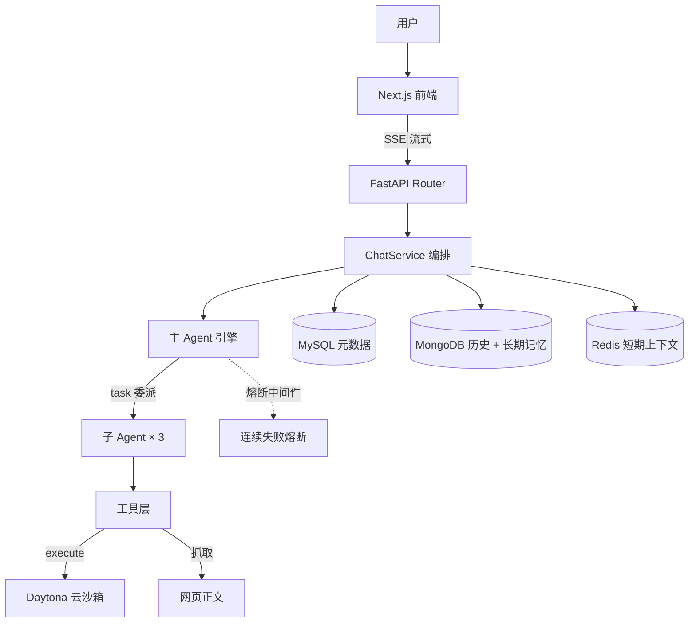

# Task Agents

自部署的多 Agent 执行平台。内置调研、开发、写作、分析四个专业引擎，任务可被委派给子 Agent 逐步完成，代码在隔离的 Daytona 云沙箱中真实运行。对话支持流式响应、会话记忆与持久化。

技术栈：LangGraph + deepagents + Daytona + FastAPI + Next.js。

## 核心能力

- **四个专业引擎**：调研 / 开发 / 写作 / 分析各自是一个独立的主 Agent，内部按工序委派给 3 个子 Agent（共 12 个）
- **云沙箱执行**：代码在 Daytona 云沙箱中真实运行，每个会话独占一个实例；只执行 Python，shell 命令与 `pip install` 会被拒绝
- **执行可审计**：每次执行都记录沙箱实例 ID、实际运行的代码、耗时与退出码
- **失控防护**：单请求步数上限、同一工具连续失败熔断、单次执行超时，阈值均可配置
- **双层记忆**：Redis 短期上下文窗口（滑动窗口 + TTL）+ MongoDB 长期记忆（跨会话沉淀）
- **分层存储**：MySQL 会话元数据 / MongoDB 对话历史 / Redis 上下文，按数据特征分派
- **流式响应与持久化**：SSE 逐字输出，`done` 事件在落库之后下发，刷新历史不会丢消息
- **会话隔离**：`session_id` 即 LangGraph `thread_id`，图状态与沙箱实例都按会话隔离
- **配置驱动**：模型、存储、沙箱、安全与成本阈值全部通过环境变量配置

---

## 架构



`router → service → repository` 严格单向调用，仓储之间互不调用，事务边界由服务层控制。

---

## 四大引擎 · 12 个子 Agent

每个引擎是**独立的主 Agent**（自己的系统提示词、自己的子 Agent 组合），切换角色即切换引擎：

| 角色 | agent_key | 子 Agent | 工具 | 典型产出 |
|---|---|---|---|---|
| 🔍 调研 | `market_researcher` | data_collector / analyst / programmer | 网页抓取 + 沙箱 | 竞品与行业分析、SWOT / PESTEL |
| 💻 开发 | `code_engineer` | architect / coder / tester | 沙箱 | **经过真实运行验证**的代码 |
| ✍️ 写作 | `content_writer` | outliner / writer / editor | — | 大纲 → 正文 → 审校成稿 |
| 📊 分析 | `data_analyst` | data_loader / statistician / visualizer | 沙箱（pandas / matplotlib） | 清洗 → 建模 → 图表 |

新增引擎的成本主要是写提示词：复制一个 `*_engine/`、在 `factory.py` 加一行、前端映射表加一项即可。

---

## 云沙箱执行

`execute` 工具背后是 Daytona 云沙箱，代码在远端真实运行。一次执行的完整链路：

```
[sandbox] 新建沙箱: thread=8f173b52-... sandbox=98319c2f-bb74-4171-88e8-002aff950e9d language=python
[sandbox] 执行开始: thread=8f173b52-... sandbox=98319c2f-... timeout=30s code_len=46
                    code='print(sum(i*i for i in range(1, 100001)) % 10)'
[sandbox] 执行完成: thread=8f173b52-... sandbox=98319c2f-... exit_code=0 耗时=2.60s output='0\n'
[sandbox] 销毁沙箱: thread=8f173b52-... sandbox=98319c2f-...
```

**执行安全边界**（`agent/sandbox_backend.py`）：

| 边界 | 做法 |
|---|---|
| **会话隔离** | 沙箱按 `session_id` 一对一路由，会话之间互不可见 |
| **只执行 Python** | shell 命令（`ls` / `cat` / `curl` …）一律拒绝并给出可替代写法 |
| **禁止装包** | `pip install` 明确拒绝，缺库时要求模型如实告知用户而非自行安装 |
| **高危命令黑名单** | `rm -rf` / `mkfs` / `sudo` / `curl \| bash` 等前置拦截 |
| **超时强制终止** | 单次执行带超时（默认 15s，可配），死循环不会挂住请求 |
| **输出限长** | 工具输出按配置截断，防止海量输出撑爆上下文与 Token |
| **凭据隔离** | 代码在远端沙箱运行，后端进程的 `.env` 与数据库口令不在该环境中 |

> 早期版本的代码执行是本地进程级约束——被执行的代码拥有后端进程的权限。当前版本已改为在独立云沙箱中执行。

**已知边界**：文件读写目前仍在本地工作区（与远端执行环境不互通），全部搬到沙箱内已列入 [ROADMAP](./ROADMAP.md)。

---

## 成本与失控治理

模型遇到执行环境错误时，往往会换个写法反复重试，一条请求可能空转上百步。为此设置了三层闸门：

| 闸门 | 配置项 | 作用 |
|---|---|---|
| **步数上限** | `AGENT_RECURSION_LIMIT`（默认 30） | 兜底截断，超限转 error 事件，不无限跑 |
| **连续失败熔断** | `TOOL_FAILURE_BREAK_THRESHOLD`（默认 3） | 同一工具 + 同一参数连续失败 N 次，**在下一次模型调用之前**终止整轮，零额外 token |
| **执行超时** | `CODER_EXEC_TIMEOUT_SECONDS`（默认 15） | 单次沙箱执行超时即终止 |
| **沙箱治理** | `SANDBOX_MAX_CONCURRENT` / `SANDBOX_MAX_PER_USER` / `SANDBOX_IDLE_TTL_SECONDS` / `SANDBOX_ACQUIRE_TIMEOUT_SECONDS` / `SANDBOX_AUTO_STOP_MINUTES` | 并发上限、单用户配额、空闲回收、远端兜底停止（默认 0 = 关闭，保持现状） |

熔断的触发位置是个细节：如果**在工具调用阶段**抛异常，会被框架捕获成一条错误消息重新喂给模型，模型会继续尝试；因此实现为**在下一次模型调用之前**终止整轮运行，此后不再产生新的 token。

---

## 双层记忆

| 层 | 存储 | 机制 |
|---|---|---|
| **短期** | Redis | 最近 N 轮滑动窗口（`REDIS_CONTEXT_MAX_TURNS`），TTL 自动过期，为 Prompt 注入提供亚毫秒读取 |
| **长期** | MongoDB (`MongoDBStore`) | 跨会话沉淀（如 `/memories/preferences.md`），由 Agent 自主读写 |
| **图状态** | Redis / 内存 (`CHECKPOINT_BACKEND`) | LangGraph checkpointer，`auto` 模式自动探测 Redis 是否支持 RedisJSON |

冷热分离带来的好处：会话冷启动只回灌最近几轮，长会话不会被历史拖垮上下文。

---

## 分层存储

| 存储 | 承载 | 选型理由 |
|---|---|---|
| **MySQL** | 会话元数据 | 列表页要排序 / 分页 / 筛选，`(user_id, updated_at)` 联合索引消除 filesort |
| **MongoDB** | 对话历史（内嵌 `messages`）+ 长期记忆 | 文档模型一次取回整条会话，免 JOIN；`$push` 契合高频追加写 |
| **Redis** | 短期上下文 + 图状态 | 亚毫秒读写 + TTL 自动过期 |

需要接受的取舍：MySQL 计数与 MongoDB 实际条数是**最终一致**，可用 `MessageWriteService.compare_counts()` 对账。

---

## 流式与持久化

SSE 事件类型：`meta` / `content` / `tool_call` / `tool_result` / `thinking` / `done` / `error`。

`done` 事件**刻意安排在落库之后**下发——前端收到它时刷新历史一定能读到本轮消息，不存在竞态。无论正常完成、异常还是客户端断连，沙箱都会在 `finally` 中回收，不漏资源。

---

## 快速开始

详细启动步骤与排障见 [backend/startup.md](backend/startup.md)。

### 环境要求

- **Node.js** >= 18
- **Python** >= 3.14 + **uv**
- **Docker Desktop**（MySQL / MongoDB / Redis）
- **Daytona 账号与 API Key**（云沙箱，[app.daytona.io](https://app.daytona.io) 申请）

### 1. 启动存储

```bash
cd backend
docker compose up -d      # MySQL(3306) + MongoDB(27017) + Redis(6379)
```

### 2. 配置后端

```bash
cd backend
cp .env.example .env
```

必填项：

```ini
LLM_API_KEY=...            # 大模型（OpenAI 兼容接口）
DAYTONA_API_KEY=...        # 云沙箱，代码执行能力依赖它
DAYTONA_API_URL=https://app.daytona.io/api
DAYTONA_TARGET=us
```

### 3. 启动

```bash
uv sync
uv run uvicorn task_agents.main:app --reload --port 8000   # 后端 :8000，文档 /docs

cd frontend && npm install && npm run dev                  # 前端 :3000
```

可选：写入演示数据，直接看到侧边栏与历史效果。

```bash
uv run python scripts/seed_demo_data.py
```

> **关于执行环境**：不配 `DAYTONA_API_KEY` 也能启动，但代码执行会返回"执行环境不可用"（熔断不会让它反复重试）。想体验完整能力请配置。
> **用户登录**：尚未实现，`user_id` 由 `frontend/src/lib/config.ts` 的 `CURRENT_USER_ID` 提供（当前 `userid_1`）。**当前无鉴权，请勿直接暴露公网。**

---

## 项目结构

```
backend/task_agents/
├── core/          配置（LLM / 三存储 / 成本闸门 / 沙箱治理）
├── database/      MySQL 引擎 + MongoDB / Redis 客户端 + Key 规范
├── repository/    仓储层（一个存储引擎一个类）
├── service/       服务层（ChatService 编排、沙箱池、熔断重置）
├── routers/       session / chat（含 SSE）
├── sandbox/
│   ├── sandbox_manager.py    沙箱机制层：创建 / 复用 / 销毁（同步原语）
│   └── sandbox_registry.py   沙箱策略层：异步适配、失败降级、生命周期
└── agent/
    ├── factory.py            四引擎统一装配
    ├── middleware/           loop_breaker（连续失败熔断）
    ├── sandbox_backend.py    受限执行 backend（只跑 Python + 安全边界）
    └── *_engine/             四个主引擎（agent.py + prompts.py + subagents/）
```

> 沙箱分层是有意的：`sandbox_manager` 全同步（贴着 SDK），`sandbox_registry` 全 async（用 `asyncio.to_thread` 把阻塞调用挪出事件循环）。边界清晰后，"忘了套 to_thread 导致整条事件循环卡死"这类 bug 无处藏身。

---

## API

| 方法 | 路径 | 说明 |
|---|---|---|
| GET | `/api/sessions` | 分页查询会话列表（按最后活跃倒序） |
| POST | `/api/sessions` | 创建会话（`session_id` 即 Agent 的 `thread_id`） |
| GET | `/api/sessions/{session_id}/messages` | 加载历史消息 |
| POST | `/api/chat/stream` | **主链路**：SSE 流式推送 + 三存储持久化 |
| POST | `/api/chat` | 一次性返回完整回复 |

完整接口与分层存储设计见 [backend/startup.md](backend/startup.md)。

---

## 技术栈

| 层级 | 技术 |
|---|---|
| 前端 | Next.js 14 + React 18 + TypeScript + Tailwind CSS |
| 后端 | FastAPI（全链路 async） |
| Agent 框架 | LangGraph + deepagents |
| 代码执行 | **Daytona 云沙箱** |
| 存储 | MySQL 8 + MongoDB 7 + Redis（SQLAlchemy 2 async / motor / redis.asyncio） |
| 包管理 | uv / npm |

---

## 路线图

全链路观测、任务状态持久化与中断恢复、Kafka 任务入口与业务钩子、执行步骤可视化、token 用量面板、沙箱并发治理等，见 [ROADMAP.md](./ROADMAP.md)。

想验证各引擎实际效果，见 [AGENT_TEST_CASES.md](./AGENT_TEST_CASES.md)（12 个用例 + 跨角色对照 + 评分卡）。

---

## License

MIT
